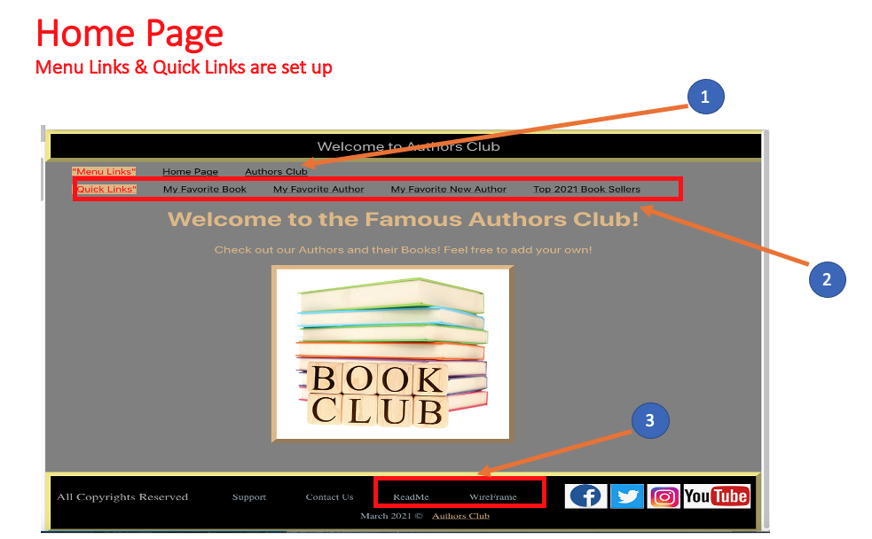
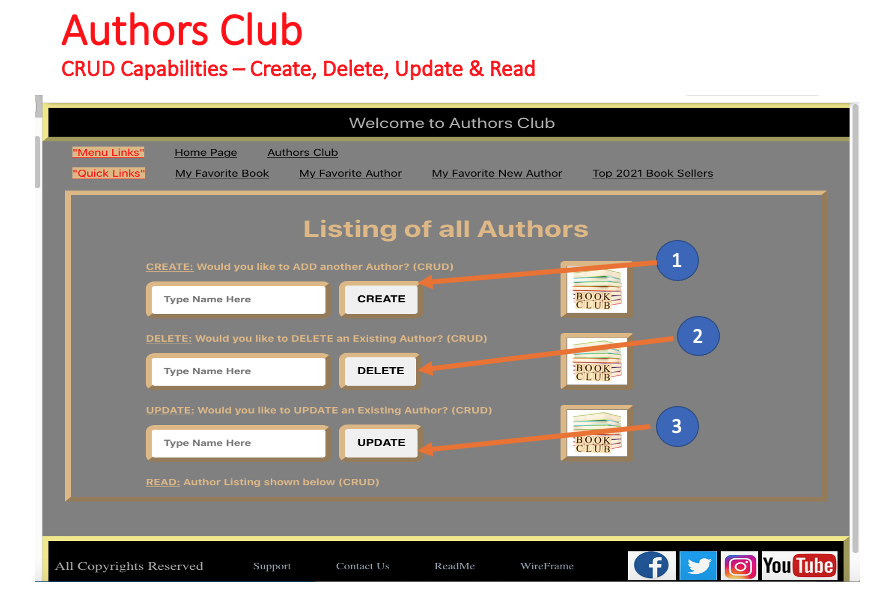
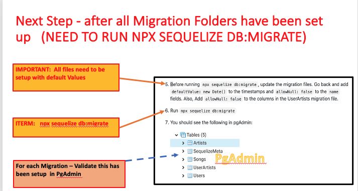
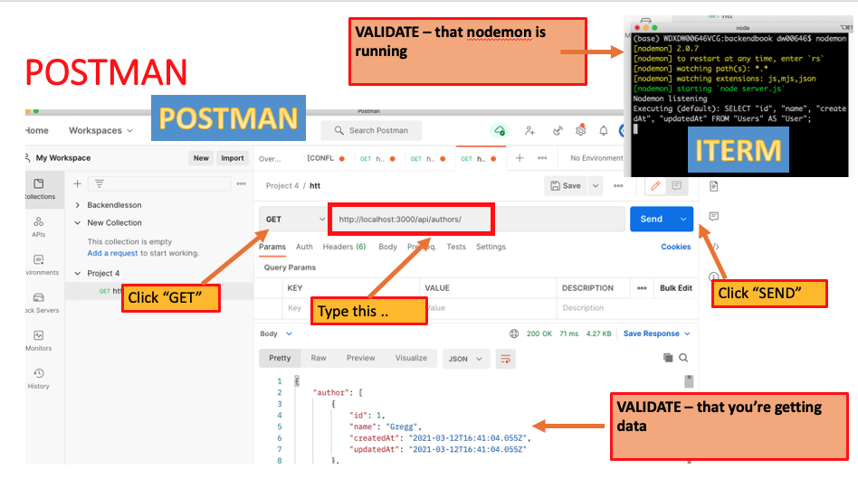
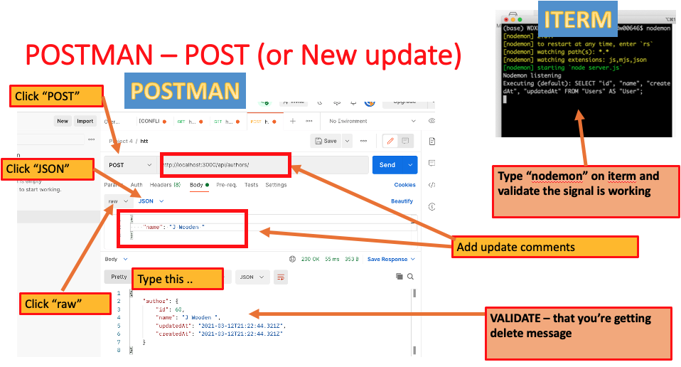
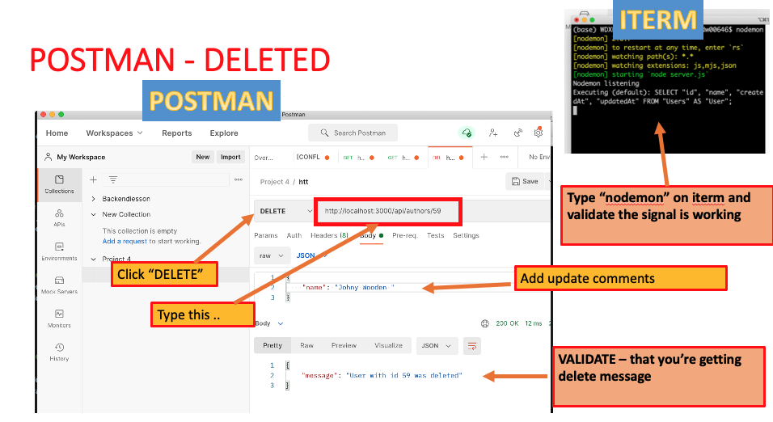
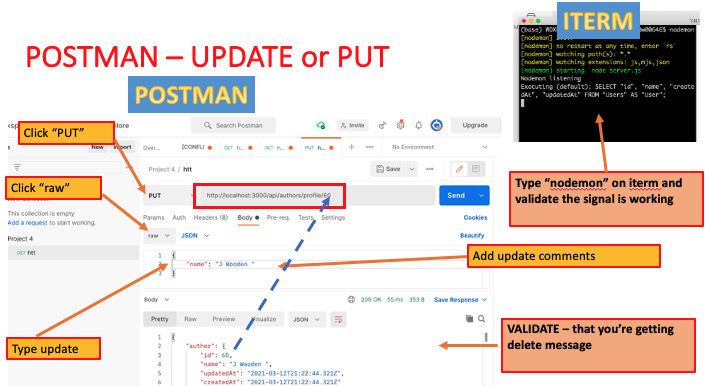

# PROJECT 4: FULL STACK 

This App can be used to help people find authors and the respective book titles

# Getting Started - Front End Home Page

To view the Front End Home Page. 

# Getting Started - Front End Home Page

To view the Authors Club Listing Page.   

# Getting Started - DATA MIGRATION 

To search a listing of all the Tables.  You will need to go into pgAdmin. 

### `Search a LISTING of User - Use the GET Command`

To search a listing of all the users.  You will need to go into POSTMAN and select the GET tab and type in http://localhost:3000/api/users.

### `To add a New UPDATE - Use the POST command`

To POST or make a new UPDATE  You will need to go into POSTMAN and select the POST tab and type in http://localhost:3000/api/authors/.

### `To DELETE an Author  - Use the DELETE command`

To DELETE an author. You will need to go into POSTMAN and select the GET tab and type in http://localhost:3000/api/authors/59.

### `To UPDATE an Author  - Use the PUT command`

To UPDATE an author. You will need to go into POSTMAN and select the PUT tab and type in http://localhost:3000/api/authors/profile/59.

### List of TECHNOLOGIES Used for Both Front End & Back End

React 
React-Router-DOM 
HTML 5  
AXIOS  
Postman  
Java Script ES6.0  
pgAdmin  
API  
Heroku  
Visual Studio  

### Contributors

Gregg Machetta 