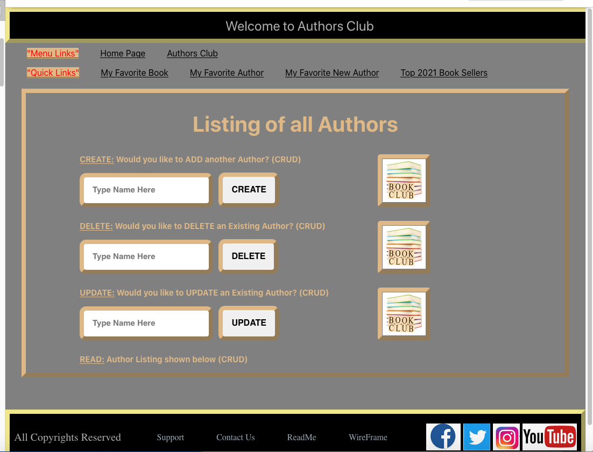

# WIREFRAME - PROJECT 4 Full Stack

The Original Concept for the Wireframe was developed on 3/13/2020.

The _`WIREFRAME`_ concept for this App was broken into 4 Tables.

1. The _`Table: User`_ is shown in the left.  
2. The _`Table: userAuthor`_ is shown 2nd from left.
3. The _`Table: Author`_ is shown 3rd.
3. The _`Table: Books`_ is shown 4th.

## Wireframe Concept Model - Back End

## Author Club Home Page - Front End

## Author Club Listing Page - Front End

By Gregg Machetta 2/17/2021